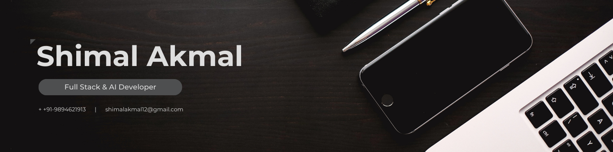

  

<h1 align="center">Hi 👋, I'm SHIMAL AKMAL D </h1>
<h3 align="center">A passionate Fullstack developer and AI developer</h3>
- 🌱 I’m currently learning **React-Native and Fluttert**

- 💬 Ask me about **REACT JS, NODE JS, MONGODB**

- 📫 How to reach me **Shimalakmal12@gmail.com**

- 🤖 Engineering At **Kongu Engineering College**

- 📄 Know about my Resume [Resume Link](https:#.pdf)

  

---

<h2 align="center">Tᴇᴄʜ sᴛᴀᴄᴋ</h2> 
<picture>
  <source media="(prefers-color-scheme: dark)" srcset="./Skills_Animation_Dark.gif">
  <source media="(prefers-color-scheme: light)" srcset="./Skills_Animation_White.gif">
  
</picture>

<h3 align="left">Frontend</h3>
<ul>
  <li>Technology :  HTML, CSS, JS</li>
  <li>Framework  :  React</li>
  <li>UI Library :  Bootstrap</li>
</ul>

<h3 align="left">Backend</h3>
<ul>
  <li>Runtime   :  Node.js</li>
  <li>Framework :  Express</li>
  <li>Database  :  MongoDB, SQL</li>
</ul>

<h3 align="left">Tools</h3>
<ul>
  <li>Version Control :  GitHub</li>
  <li>IDE             :  VS Code</li>
</ul>
 

---

 
 

<h2 align="center"> Leetcode Stats </h2>

  

<!--Github stats Table--> 
<h2 align="center">📊 Gɪᴛʜᴜʙ Sᴛᴀᴛs 📊</h2>

<table width="100%">
  <tr>
    <td width="50%">
      <h3 align="center"><strong>Gɪᴛʜᴜʙ Sᴛᴀᴛs</strong></h3>
      

        
      

    </td>
    <td width="50%">
      <h3 align="center"><strong>Sᴛʀᴇᴀᴋ Sᴛᴀᴛs</strong></h3>
      

        
      

    </td>
  </tr>
</table>
 

<!--Contribution Graph-->
<h2 align="center">📈 Cᴏɴᴛʀɪʙᴜᴛɪᴏɴ Gʀᴀᴘʜ 📈</h2>

    

<!--Contact Section--> 

<h2 align="center">🤝 Cᴏɴɴᴇᴄᴛ Wɪᴛʜ Mᴇ 🤝</h2>

  
  
  
  
  
  </a>

 

  

