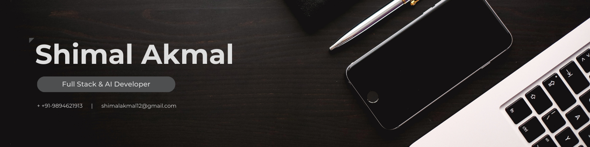

  
    
  

  
    
  
  
  
  

---

### 👨‍💻 About Me
<table>
<tr>
<td width="60%">

- 🤖 **Education:** B.Tech in AI & ML @ Kongu Engineering College (CGPA: 8.2/10)
- 🏆 **Achievements:** 8x Hackathon Winner 🥇
- 🌱 **Currently Learning:** Agentic AI, Advanced RAG Systems, Distributed Systems
- 💡 **Interests:** Machine Learning, Full-Stack Web Development, System Design
- 📄 **Resume:** [View my Resume](https://github.com/Shimal007/Shimal007/blob/main/23ALR099.pdf)
- 💬 **Ask me about:** React, Node.js, Flask, LLMs, LangChain, Agentic AI

</td>
<td width="40%" align="center">
  
</td>
</tr>
</table>

---

### 💼 Professional Experience

> **Software Developer Intern (AI)** @ *PunchBix* `May 2025 – July 2025`
> - 🚀 **Engineered** a full-stack AI platform for content generation using **Gemini 1.5 Pro** and **Stable Diffusion**.
> - ⚙️ **Developed** a robust Node.js backend for secure API management and credit tracking.
> - 💻 **Integrated** with a React.js frontend for live markdown editing and seamless UX.
> - *Tech Stack:* `React.js`, `Node.js`, `Express`, `MongoDB`, `Gemini`, `Stable Diffusion`

---

### 🚀 Featured Projects

| 🤖 **Next-Gen Automated Interview Hub** | 📸 **AI-Powered Face Recognition Platform** |
| :--- | :--- |
| **Description:** Proctored multi-round mock interview platform simulating real HR interactions. <ul><li>AI-based resume analysis & technical questioning</li><li>Memory-driven interactions</li><li>Full-screen monitoring & instructor assignment</li></ul> | **Description:** Full-stack platform for face-based search, duplicate detection, and cloud-based photo retrieval. <ul><li>Matches reference image against large datasets</li><li>Cloud storage & batch processing integration</li></ul> |
| **Stack:** `<LangChain>` `<LangGraph>` `<Llama>` `<React>` `<Flask>` `<MongoDB>` `<Docker>` | **Stack:** `<React>` `<Flask>` `<MTCNN>` `<FaceNet>` `<OpenCV>` `<Google Drive API>` `<CLIP>` |

 

| 🛡️ **Intelligent Cybercrime Analysis System** | 🎟️ **Museum Ticket Booking Chatbot** |
| :--- | :--- |
| **Description:** Hybrid RAG-based cybercrime analysis system mapping incidents to IPC/IT laws. <ul><li>Knowledge Graphs to report portals & gather evidence</li><li>Predictive risk analysis & automated follow-ups</li></ul> | **Description:** AI-powered WhatsApp & web chatbot enabling end-to-end museum ticket booking. <ul><li>LLM and RAG integration for conversational booking</li><li>Secure payments, geolocation, session handling</li></ul> |
| **Stack:** `<React>` `<Node.js>` `<LangGraph>` `<Neo4j>` `<Flask>` `<LLMs>` | **Stack:** `<LangChain>` `<Llama>` `<Express>` `<MySQL>` `<Razorpay>` `<WhatsApp API>` |

---

### 🛠️ Tech Stack & Skills

<b>Frontend Development</b>

 

  
  
  
  
  

<b>Backend & Database</b>

 

  
  
  
  
  
  

<b>AI, ML & Tools</b>

 

  
  
  
  
  
  

 

  <picture>
    <source media="(prefers-color-scheme: dark)" srcset="./Skills_Animation_Dark.gif">
    <source media="(prefers-color-scheme: light)" srcset="./Skills_Animation_White.gif">
    
  </picture>

---

<h2 align="center">🏆 ACHIEVEMENTS 🏆</h2>

| 🏁 Event | 🏅 Achievement | 🚀 Highlights | 📅 Year |
| :--- | :--- | :--- | :--- |
| 💻 **CSI 24 Hour Hackathon** – Kongu Engineering College | 🥇 1st Prize | Cyber Security In Email | 2026 |
| 📢 **Eareyes 2k26** – Kongu Engineering College | 🥇 1st Prize | paper presentation and project presentation | 2026 |
| 📄 **GEG** – Kongu Engineering College | 🥇 1st Prize | paper presentation | 2026 |
| 🤖 **SRCAS Hackathon 2.0** – Sri Ramakrishna College of Arts and Science | 🥇 1st Prize | LLM for Cyber Issue SOPs | 2025 |
| 👤 **Newells2K25** – Kongu Engineering College | 🥇 1st Prize | AI Mock Interviewer | 2025 |
| 🧠 **GEN AI Cognitive Hackathon** – Kongu Engineering College | 🥇 1st Prize | StudyMate - AI Study Assistant | 2025 |
| 💡 **CSI Project Expo** – Kongu Engineering College | 🥇 1st Prize | Museum Ticket Chatbot | 2025 |
| ⚙️ **CSD 24 Hour Hackathon** – Kongu Engineering College | 🥇 1st Prize | AI Quiz Generator | 2025 |
| 👁️ **Exodica Hackathon** – Kongu Engineering College | 🥇 1st Prize | Face Album Matching | 2025 |
| 🏆 **Hackvotrix'25 Hackathon** | 🥇 1st Prize | Hackathon | 2025 |
| 🔓 **Cybot Fusion'26 (Hackathon)** – Kongu Engineering College | 🥈 2nd Prize | Real Time Phishing Detection | 2026 |
| 🏆 **HCS Coding Challenge (Coding Competition)** – Kongu Engineering College | 🥈 2nd Prize | Coding Competition | 2026 |
| 🧩 **KGISL Coding Contest** – KGISL Institute | 🥈 2nd Prize | Complex DSA Problem Solving | 2024 |
| 💻 **Hacknovate'25 Hackathon** | 🥈 2nd Prize | Hackathon | 2025 |
| 🤖 **IBM-GenAi Hackathon** | 🥈 2nd Prize | GenAI Hackathon | 2025 |
| ⚡ **IEEE Version -3.0** – Kongu Engineering College | 🥉 3rd Prize | NETGEN AUTOMATED INTERVIEW HUB | 2025 |

  🏆 <b>Hackathons:</b> 8 Wins (6x 🥇, 2x 🥈) &nbsp;|&nbsp; 📢 <b>Paper & Project Expos:</b> 4 Wins (4x 🥇) &nbsp;|&nbsp; 💻 <b>Coding Competitions:</b> 3 Wins (3x 🥈) &nbsp;|&nbsp; ⚡ <b>Technical Symposiums:</b> 1 Win (1x 🥉)

#### 📜 Certifications & Memberships

  
  
    
  
  
  

---

## LeetCode Badges:

  
  
  
  
  
  

    

  
  
  
  
  

    

  
  
  
  

---

### 📊 GitHub & Coding Stats

  

  

  

---

  

